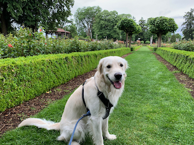

# Hey! 👋

I'm a student at [App Academy](https:github.com/appacademy) training to be a software engineer. I have experience in `Javascript`, `Python`, `React`, `Redux`, `Node`, `Express`, `PostgreSQL`, `MongoDB`.

- 🌱 Currently working on [Mighty](https://github.com/matt-ramotar/mighty) and [Paw Trails](https://github.com/matt-ramotar/pawtrails)

- 🧰 Previously worked for a `healthcare` `research-consulting` group. In college I studied `economics`, `biology`, `philosophy`

- ☀️ Enjoy 🏃🏽‍♂️ running, 🥾 hiking, 🎿 skiing, 🎾 tennis

- 🐕‍🦺 Best friend of a 2-year-old Golden Retriever named Tag!
